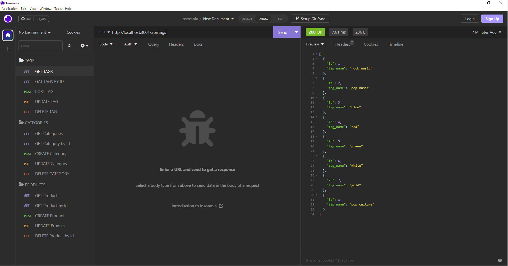

# E-Commerce_Back_End

## Description

The goal of this project is to build an e-commerce back end application  based on user storyand demonstrate all database quary routs using Insomnia. The app is built based on a user story provided on UW bootcamp Module 13 chalenge. Full content of user story and acceptance criteria is listed under github issue#1 of this repasatory. 

## Usage

To start application first  run "node server.js" form project root directory so that it will go to listining. Once server is in listening mode, test all routs using Insomnia.The following walkthrough vedio will demonstrate the function.

[Walkthrough Vedio](https://youtu.be/b7PlPKfUYGU)

## Credits
I used resorces in UW bootcamp modules and mini-project examples.

## License
MIT License

Copyright (c) 2023 GET

Permission is hereby granted, free of charge, to any person obtaining a copy
of this software and associated documentation files (the "Software"), to deal
in the Software without restriction, including without limitation the rights
to use, copy, modify, merge, publish, distribute, sublicense, and/or sell
copies of the Software, and to permit persons to whom the Software is
furnished to do so, subject to the following conditions:

The above copyright notice and this permission notice shall be included in all
copies or substantial portions of the Software.

THE SOFTWARE IS PROVIDED "AS IS", WITHOUT WARRANTY OF ANY KIND, EXPRESS OR
IMPLIED, INCLUDING BUT NOT LIMITED TO THE WARRANTIES OF MERCHANTABILITY,
FITNESS FOR A PARTICULAR PURPOSE AND NONINFRINGEMENT. IN NO EVENT SHALL THE
AUTHORS OR COPYRIGHT HOLDERS BE LIABLE FOR ANY CLAIM, DAMAGES OR OTHER
LIABILITY, WHETHER IN AN ACTION OF CONTRACT, TORT OR OTHERWISE, ARISING FROM,
OUT OF OR IN CONNECTION WITH THE SOFTWARE OR THE USE OR OTHER DEALINGS IN THE
SOFTWARE.
